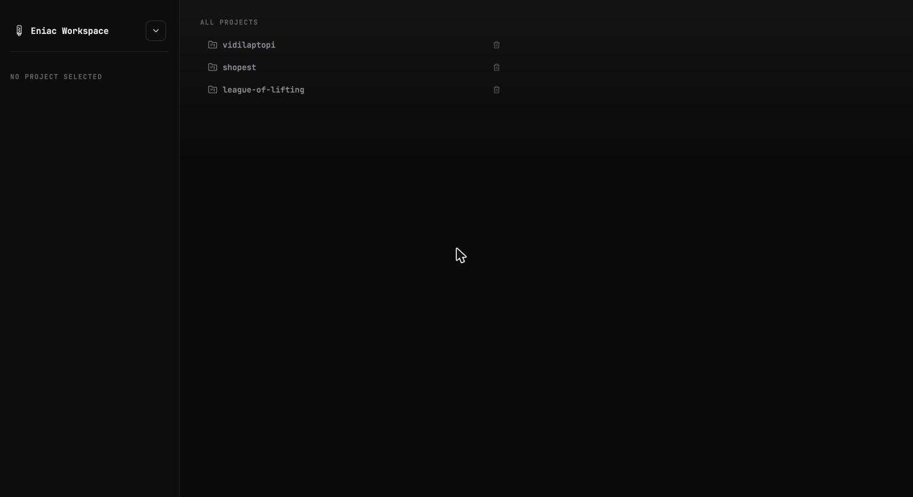
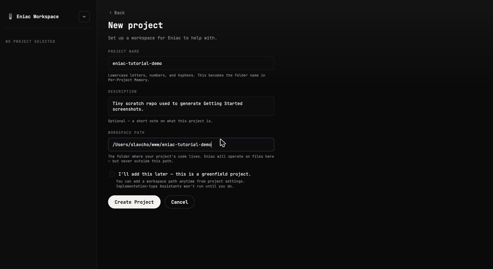
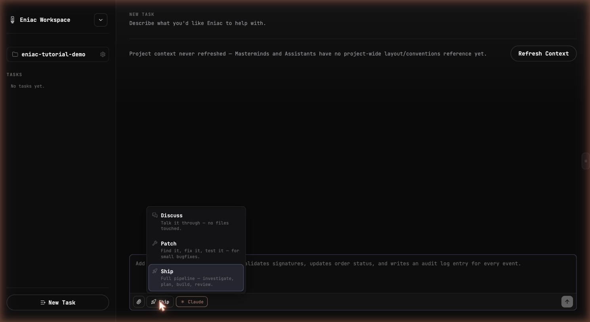
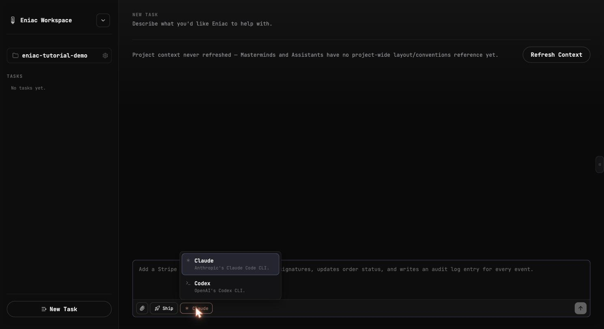
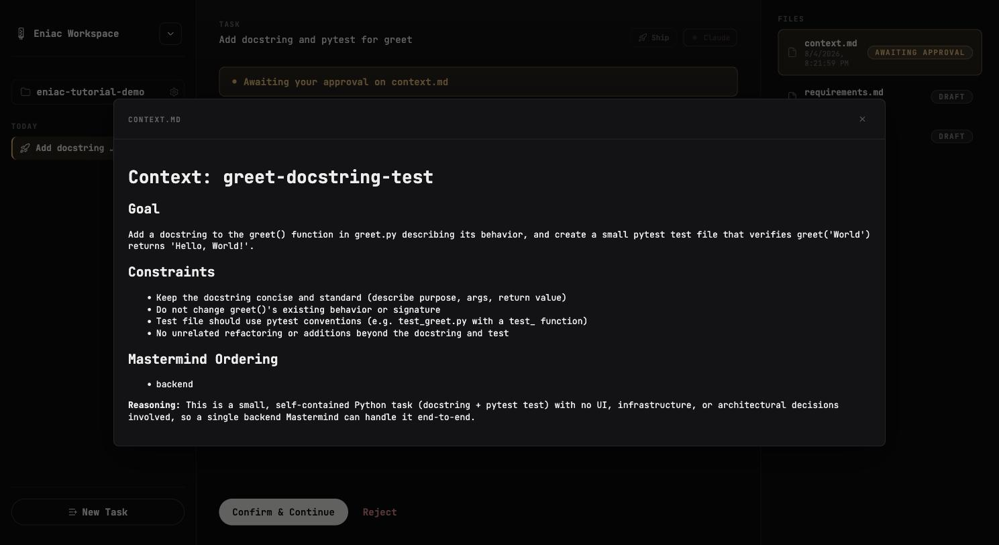
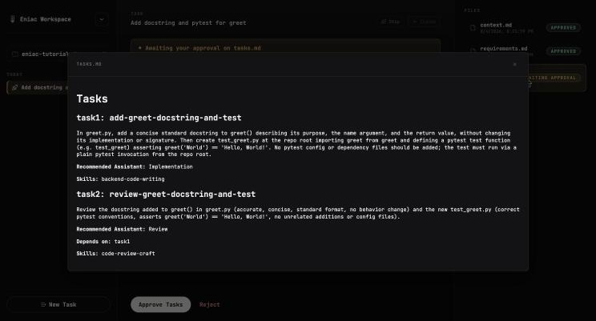
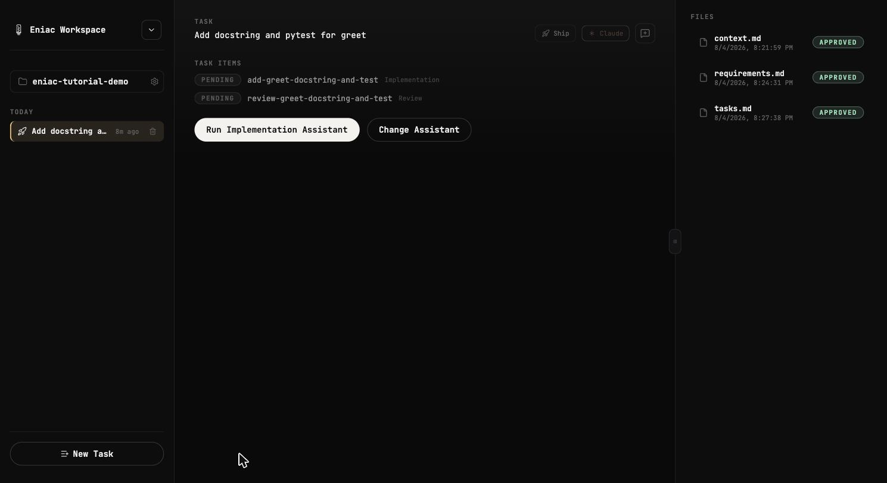
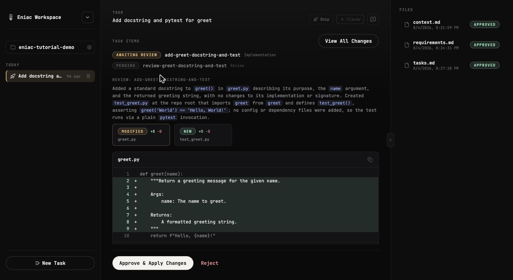
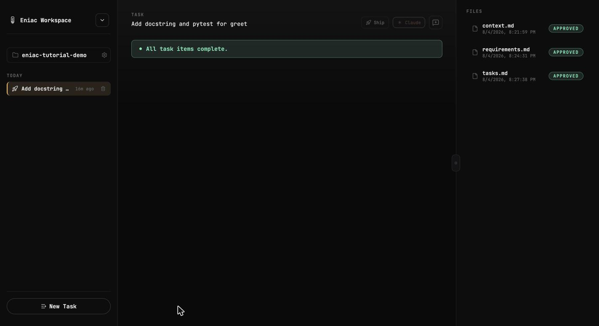

# Getting Started

Eniac is a personal, local, multi-agent workplace tool: you describe what you want in
plain language, and a Supervisor → Mastermind → Assistant pipeline turns that into
reviewed, applied code changes in your own repo — using your own Claude Pro/Max
subscription (`claude` CLI) and/or ChatGPT/OpenAI account (`codex` CLI) rather than
paid model APIs. See [ARCHITECTURE.md](ARCHITECTURE.md) for the full design.

This guide walks through installing it, creating a project, and running your first task.

## 1. Prerequisites

- **Python 3.9+**
- **Node 18+**
- At least one of:
  - the [`claude` CLI](https://docs.claude.com/claude-code), logged in via `claude auth login`
  - the [`codex` CLI](https://developers.openai.com/codex), logged in via `codex login`

You don't need both — Eniac works with either. Whichever one isn't authenticated just
shows up disabled in the agent picker later; setup only fails if *neither* is available.

## 2. Setup & run

From the repo root:

```
make setup
```

This checks the prerequisites above, sets up `~/.eniac/` (Eniac's own state — a SQLite
DB and per-project memory files, separate from any code you point it at — asking
whether to keep/back up/wipe it if one already exists from a previous run), and
installs backend and frontend dependencies.

```
make start
```

Starts the backend at `http://localhost:1946` and the frontend at
`http://localhost:5173`. Open the frontend URL in your browser. Stop both from another
terminal with:

```
make down
```

## 3. First look at the app



The left sidebar is your workspace: a dropdown next to "Eniac Workspace" for creating a
new project or jumping to "All Projects," and — once a project is open — its task list
below. The main panel shows either your projects (nothing selected yet) or the
currently open project's composer.

## 4. Creating a project

Open the workspace dropdown → **New Project**.



- **Project name** — lowercase letters, numbers, and hyphens; becomes the folder name
  in Eniac's per-project memory.
- **Description** — optional.
- **Workspace path** — the folder on disk where your project's actual code lives.
  Eniac only ever touches files inside this path.
- **"I'll add this later"** — check this for a greenfield project with no code yet.
  You can set the workspace path anytime from project settings; implementation-type
  Assistants just won't run until you do.

If the workspace path you point at contains multiple repos (rather than being a single
git repo itself), Eniac auto-detects this as an **orchestrator project** and shows a
"multiple repositories detected" confirmation — tasks on an orchestrator project can
then be scoped to one child repo, or left unscoped for anything cross-cutting.

## 5. Submitting your first task

Once a project is open, the composer at the bottom is where every task starts.



Pick a **mode**:

- **Discuss** — a free-form conversation. Read-only, no files touched, live web search
  on. Use this to talk through an idea or ask questions about your codebase.
- **Patch** — a single agent works directly in your real repo to find and fix something
  small (Read/Grep/Glob/Edit/Write + a gated `Bash` for running tests). No investigation
  or planning stages. Requires the workspace to have a clean git tree.
- **Ship** — the full pipeline: investigate → plan → build → review. This is the
  flagship flow and the one walked through below.



Pick an **agent** — Claude or Codex, whichever CLI you want this task to run through.
Both mode and agent are **locked in once the task starts** (a resumed session is only
ever valid against the backend that produced it), so pick deliberately.

Type your request and submit.

## 6. Walking through a Ship task

Every stage of Ship is gated on your approval — nothing proceeds without you clicking
through it, and every stage's output is a plain markdown file you can read (and if
needed, edit) before continuing.

**Context.** The Supervisor reads your prompt, decides which Mastermind(s) the task
needs (Frontend, Backend, DevOps, Architect — a task can involve more than one), and
writes `context.md`: the goal, constraints, and its reasoning for that Mastermind
choice.



Review it (click the file in the **Files** panel on the right to see the full content),
then **Confirm & Continue** — or **Reject** with feedback to have it redone.

**Requirements → Tasks.** The chosen Mastermind investigates your actual codebase and
writes `requirements.md`, then breaks the work into ordered task items in `tasks.md`,
each with a recommended Assistant.



Same pattern: review, then **Approve Requirements** / **Approve Tasks**.

**Execution.** Once tasks are approved, each item appears with a **Run \<Assistant\>**
button (or **Change Assistant** if you want to override the recommendation).



Running an item hands it to its Assistant (Implementation, Review, Test, and others,
depending on the domain), which does the actual work and comes back with a real diff
for you to read.



**Approve & Apply Changes** writes it to disk; **Reject** sends feedback back for
another attempt. Once every item is done, the task is complete.



## 7. Other things you'll run into

- **Files panel** (right side) — every stage's artifact (`context.md`,
  `requirements.md`, `tasks.md`, diffs) with its approval status, so you can always see
  what's been approved and what's still a draft.
- **Project context refresh** — a project's `context_refreshed_at` and a
  "N tasks completed since last refresh" nudge track when its project-wide
  layout/conventions memory might be stale. **Refresh Context** (on the project page)
  regenerates it.
- **Consult Mastermind** — once a task's `tasks.md` is approved, a "Consult Mastermind"
  button lets you propose new or deprecated task items mid-flight (e.g. scope changed
  after seeing the first diff), previewed as a diff to `tasks.md` before you approve it.
- **Image attachments** — the composer accepts image uploads (drag-drop or the paperclip
  button) alongside your prompt text.
- **Repo scoping** — on an orchestrator project, task creation lets you target one child
  repo specifically; leaving it unscoped creates a cross-cutting, orchestrator-root task.

## 8. Troubleshooting

- **"Neither claude nor codex CLI is installed and authenticated"** during `make
  setup` — install and log into at least one (`claude auth login` or `codex login`),
  then re-run.
- **"port \<N\> is already in use"** during `make start` — something else is bound to
  1946 or 5173; free it (or stop a previous `make start` you forgot was running: `make
  down`) and retry.
- **An agent option is greyed out in the picker** — that CLI isn't authenticated on
  this machine. Run its login command and reload the page; availability is checked live,
  not cached.
- **Stopping everything** — `make down` from the repo root kills both the backend and
  frontend processes it started.
